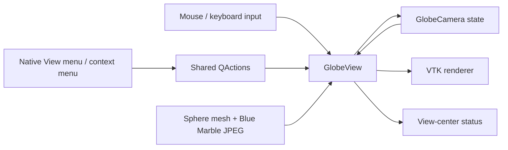

# Globe viewer — initial design

Status: initial desktop viewer design, with navigation updated for regional maps.
See [tiled Blue Marble](blue-marble-prototype.md) for the current version 0.3 display and navigation limits.
The [regional map implementation](map-packages-implementation.md) records the version 0.2 experiment. This document covers the globe
and its navigation; graph editing and hazard scoring remain future work.

## Objective and scope

Provide an offline, interactive geographical backdrop for StrataScry GGM.
NASA's August 2004 Blue Marble image is mapped onto a sphere. Users survey the
world by rotating and zooming it. This iteration has no graph objects, routing,
project saving, elevation model, terrain collision system, or imagery service.

The desktop implementation uses Python, PySide6, PyVista, and VTK through
pyvistaqt. Qt provides the native menu bar, window, input handling, and dialogs;
VTK renders the textured geometry. Python does not draw each pixel.

## Requirements → functions → logical components → implementation

| ID | Requirement | Function | Logical component | Implementation / verification |
|---|---|---|---|---|
| GV-01 | Display a textured 3D globe | Map equirectangular imagery onto sphere | Geometry + renderer | `geometry.globe_mesh_data`, `globe.GlobeView`; mesh and asset tests, visual check |
| GV-02 | Left drag surveys the globe | Convert pointer displacement to longitude / latitude | Navigation state | `GlobeCamera.orbit`, Qt mouse events; camera tests and GUI drag test |
| GV-03 | Wheel / trackpad, menus, and Command +/- zoom | Change camera distance within bounds | Navigation state + shared actions | `GlobeCamera.zoom`, `GlobeView.wheelEvent`, `MainWindow`; clamp and GUI tests |
| GV-04 | Reset view | Restore canonical center and fit globe to viewport | Camera state | `GlobeCamera.reset`; aspect-ratio and action tests |
| GV-05 | Every globe interaction is accessible under native View | Share actions among menu, shortcuts, and context menu | Action registry | `MainWindow._build_menus`; action parity test, macOS visual check |
| GV-06 | Work without credentials or runtime internet | Read local imagery | Packaged asset | `importlib.resources`; checksum and wheel contents check |
| GV-07 | Preserve imagery provenance | Display credit and record source | Credit dialog + attribution file | `assets/ATTRIBUTION.md`, metadata JSON, View → Imagery Credits |

“Physical” allocation for this software is its runtime/deployment: a desktop
process, Python virtual environment, bundled image, Qt Cocoa platform plugin,
and a GPU-capable VTK render window. There is no backend or runtime map API.

## Architecture

- `app.py`: create QApplication, configure rendering, launch the window, report startup errors.
- `window.py`: desktop layout, native menus, one QAction per operation, status and help.
- `geometry.py`: renderer-independent coordinate conversion, mesh UVs, bounded camera state.
- `globe.py`: textured mesh, optional graticule, input events, camera application and rendering.
- `assets/`: NASA JPEG, machine-readable provenance, attribution.
- `src/tests/`: geometry, asset, and interactive Qt regression tests.

Menus and shortcuts act on the same state as pointer gestures. The context menu
reuses the View menu's QAction instances, so check states and behavior cannot
drift between menus. “Show Context Menu” appears only in View to avoid a
recursive context menu. Quit is an application lifecycle action and follows
macOS's standard application menu placement. macOS supplies its native
Enter / Exit Full Screen item under View; that system-managed item is not
duplicated in the context menu. No artificial Edit / Window / Help
menus are added to this initial viewer.

## Navigation contract

| Operation | Pointer | Keyboard on macOS | View menu |
|---|---|---|---|
| Rotate | Left-button drag | Arrow keys, 10° per press | Rotate submenu |
| Zoom in / out | Vertical wheel or trackpad scroll | Command + / −; bare + / − also work | Zoom In / Out |
| Reset | — | Command 0 | Reset View |
| Latitude / longitude grid | — | Command G | Show Latitude / Longitude Grid |
| Full screen | macOS window control | Use View on macOS; F11 elsewhere | Enter / Exit Full Screen |
| Context menu | Right-click or Control-click | Shift F10 | Show Context Menu |
| Instructions | — | ? | Navigation Help |
| Attribution | — | — | Imagery Credits |

On other desktop systems, Qt uses Control in place of Command and F11 for full
screen. Only macOS is the initial validation target. Plain scrolling is the
specified trackpad interaction; pinch zoom is not implemented.

The globe stays north-up. Dragging feels like pulling its surface: dragging
right moves the view center west; dragging down moves the view center north.
Drag sensitivity scales with camera altitude and viewport height. Rotation
clamps latitude at ±89.5° to avoid the north-up singularity at the poles, wraps
longitude to [-180°, 180°), and still allows the polar surface to be seen.

The camera looks at the sphere center with a 38° vertical field of view. Zoom
changes altitude (`distance − 1`) multiplicatively (factor exp(-0.16 × steps)),
with radial distance clamped to [1.0002, 20] sphere radii. It never crosses the surface. It zooms about the
view center, not the mouse pointer. Reset centers on 25°N, 90°W and fits the
sphere with margin based on both viewport dimensions. Reset is view-dependent,
not a fixed camera distance. Resize preserves the user's camera; Reset refits.

## Geometry and future integration boundary

A right-handed Earth-centered frame uses +X at longitude 0° / latitude 0°,
+Y at 90°E / 0°, and +Z at the north pole. For longitude λ, latitude φ,
and unit radius:

`(x, y, z) = (cos φ cos λ, cos φ sin λ, sin φ)`

The image covers longitude [-180°, 180°] west to east and latitude [90°, -90°]
top to bottom. Mesh texture coordinates are `u=(λ+π)/(2π)` and
`v=(φ+π/2)/π`; VTK's bottom-origin texture convention is accounted for.
The mesh duplicates its antimeridian vertices, so no face interpolates across
the texture seam. The optional 30° graticule sits slightly above the sphere.

Future graph objects should retain geographical coordinates in their data model
and transform them for display. They should not store screen coordinates or
render-mesh vertex indices as their position. The current sphere is a display
approximation; precise geodesy, Earth ellipsoid calculations, routing, and
terrain height will need explicit requirements later. Visual graph layers need
not each become an additional concentric sphere.

## Imagery and performance decisions

The bundled JPEG is the original NASA-distributed 5400 × 2700 derivative,
approximately 2.2 MiB compressed. Its decoded RGB pixels require about 42 MiB;
GPU/internal copies and library overhead increase actual memory use. The mesh
has 65,341 vertices and 64,800 quad faces. The application renders on camera or
view changes rather than on an idle animation timer.

Unlit imagery preserves the readable basemap over the entire visible hemisphere;
there is no simulated sun or day/night masking. Topographic shading belongs to
the image, not to the mesh. Zooming enlarges a single texture and cannot reveal
new detail. A tile pyramid would be a separate future feature for closer views.

Source and usage references are in `src/stratascry/assets/ATTRIBUTION.md`.
No image fetch, API key, account, or external service is used at runtime. The
application's credits dialog contains optional external links.

## Validation

See `designs/verification.md` for executed checks and remaining limitations.
Tests exercise geometry at cardinal points and the seam, camera bounds and fit,
asset integrity, action consistency, and actual Qt input dispatch. Package
verification checks that the installed application retains its imagery.
