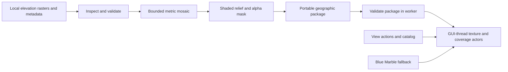

# Regional map packages — implementation

Current prototype direction: [tiled Blue Marble](blue-marble-prototype.md). Regional terrain tools remain an opt-in experiment via `--map-packages`.

Implemented September 20, 2026, in version 0.2.0. This is the first usable
increment (stages 0–2) of the [approved plan](map-packages-plan.md).
[Verification and evidence limits](map-packages-verification.md) accompany it.
Stage 3, viewport-driven local tiles and a bounded tile cache, remains future work.

## User workflow

All controls are under **View → Map Packages** and reuse the same actions in
the context menu. The global Blue Marble background remains available offline.

1. Download elevation data separately. NASADEM accepts named 1-arc-second `.hgt`
   files or individual NASADEM ZIPs containing one elevation HGT. USGS accepts
   single-band elevation GeoTIFFs; place their same-basename `.xml` metadata
   beside them when supplied. The initial USGS validation uses 3DEP 1/3 arc-second
   data. The adapter does not establish a file's provider from its layout alone.
2. Choose **Prepare Package from Local Data…**, select the product and files,
   then **Inspect Sources and Set Bounds**. Adjust west/south/east/north bounds,
   display size, and any known metadata. Unknown elevation units require an
   explicit selection. An override records a declaration; it does not transform
   a vertical datum. Multiple source rasters require a known common vertical
   reference or an explicit declaration of that common reference.
3. Choose **Prepare Package…** and an existing parent directory outside the
   repository. A new folder is created from the package name. Existing folders
   are never overwritten. Completion adds the package to the catalog, selects
   it and fits its bounds in the viewer.
4. To use a package prepared elsewhere, choose **Add Local Package…** and select
   its folder. Choose among catalog entries under **Active Package**. Only one
   regional image is active at a time; choosing None restores Blue Marble alone.
5. Use **Zoom to Package**, **Show Package Coverage**, **Map Appearance…**, and
   **Package Details…**. **Remove from Catalog…** leaves all package files on disk.

A cyan outline approximates the active image's valid-data footprint, including
holes. Grey broken rectangles mark inactive package bounds. These are map
coverage indicators, never graph edges or hazard objects. The strip above the
map names the active package and reports whether the view center is covered.
The image stays transparent where data is missing, revealing Blue Marble.
Opacity and brightness affect the map; outlines retain their contrast.

The catalog uses Qt's application-local data location. On this Mac it is
`~/Library/Application Support/StrataScry/StrataScry GGM/maps/catalog.json`.
It stores absolute paths, names, IDs and bounds, not source rasters. Moving a
package is supported: add its new folder to update the existing ID. The last
active package is restored on launch; camera and appearance settings are
session state. Missing/corrupt packages produce an error without deleting data.

Two example packages are stored under that directory's `examples/` folder:
`marin-usgs` and `marin-nasadem`. The NASADEM example is explicitly labeled as a
derived sample from the NatCap mosaic; it is not an original NASA archive.
Both deliberately extend slightly north of their source tile to demonstrate
transparent gaps and fallback. These local examples are not bundled with Git.

## CLI for reproducible preparation

The CLI uses the same builder and validation as the desktop workflow:

```sh
python -m stratascry.maps inspect --source usgs /data/USGS_13_n38w123.tif
python -m stratascry.maps prepare --source usgs \
  --name 'Marin terrain' --output /data/maps/marin \
  --bounds -122.8 37.7 -122.4 38.05 --max-side 2048 \
  /data/USGS_13_n38w123.tif
python -m stratascry.maps validate /data/maps/marin
```

The output parent must already exist, and the output directory must not exist.
For NASADEM use `--source nasadem` and the original named HGT or its ZIP.
`--units metres|feet|us_survey_feet`, `--vertical-reference`, `--source-url`, and
`--acquisition-date` record explicitly supplied information when needed.
Do not override unknown metadata merely to make an import pass.

## Design allocation and data flow

| Component under `src/stratascry/maps/` | Responsibility |
|---|---|
| `sources.py` | Inspect local inputs, safe HGT extraction, CRS/units/metadata |
| `prepare.py` | Bounded mosaic, metric hillshade, geographic display assets |
| `model.py` | Package format, validation, local assets, valid-pixel coverage |
| `catalog.py` | Atomic local registry; removal without deleting data |
| `renderer.py` | Geographic patch, footprint actors, appearance and camera fit |
| `ui.py` | Shared View actions, forms, status, background jobs/cancellation |
| `__main__.py` | Inspect, prepare and validate CLI |



Derivatives run on a region-centered azimuthal equidistant grid in metres.
Elevations are converted from declared units, with source scale/offset applied.
The first valid input wins in overlapping areas. Bilinear reprojection preserves
missing-data masks. Hillshade averages four western/northern light directions
at 45° elevation; it has no terrain exaggeration. No elevation is invented to
fill gaps, and zero elevation is valid when not declared no-data by its source.

The RGBA result is reprojected to EPSG:4326, with rows north-to-south and columns
west-to-east. Geographic mesh UVs and VTK's texture convention match this layout.
Patch tessellation is at most 0.03° per segment (minimum 16 segments per side).
Radius offsets are visual separation only: base 1, image 1.000002, coverage
1.000006, graticule 1.000008. The Earth remains spherical; relief is an image.

Zoom now scales camera altitude, `distance − 1`, by `exp(−0.16 × steps)` and
clamps distance to [1.0001, 20] radii. The near clipping plane scales down with
altitude. The minimum altitude is approximately 637 m using a 6,371 km reference
radius. This is a navigation bound, not a terrain collision guarantee.

Preparation/validation runs in a Qt worker. VTK actors and UI changes remain on
the main thread. Cancellation is cooperative between raster stages and hash
chunks; a running GDAL operation may finish before cancellation takes effect.
Closing waits for that worker instead of destroying a running thread. Output is
built in a temporary sibling directory and published only when complete. A
cancellation arriving after publication can leave a complete unregistered
package; it can be added later. Original rasters remain unchanged.

## Package format and provenance

A version-1 package contains `manifest.json`, `display/relief.png`, `preview.png`,
`coverage.geojson`, and `attribution.md`. It is usable without the original inputs.
The manifest records a UUID, product declaration, source names/hashes, original
CRS/sampling/units/no-data, known source dates and vertical reference, processing
CRS/settings/library versions, display dimensions/sampling, and asset hashes.
USGS FGDC sidecar XML is retained in normalized form with its original hash;
external DTD references are not fetched. Unavailable dates remain unspecified.
Build time does not stand in for acquisition, publication or download time.

Display sampling is explicitly separate from native source sampling and from
geographic accuracy. The provenance identifies the importer-declared provider;
format validation cannot authenticate an agency or independently verify terrain.
Portable asset paths must stay inside the package, checksums must match, and
unsupported schemas, excessive dimensions or invalid geometry are rejected.
Checksums detect corruption, not malicious replacement of a manifest and assets.

## Limits and resolved preliminary choices

- Default display limit: 2048 pixels per side; selectable 128–4096. One RGBA
  texture is at most 16 MiB by default or 64 MiB at the maximum, before CPU/GPU
  copies and preparation arrays. These are texture limits, not whole-process
  memory guarantees. Source rasters are read into a bounded destination grid.
- Up to 16 inputs per package and 128 catalog entries. Same-product inputs may
  have different horizontal CRSs; vertical references must be compatible.
- Maximum regional span: 12° per axis, between 89°S and 89°N. Dateline-crossing
  requests are explicitly rejected; prepare a separate package on each side.
  Automatic splitting and pole-crossing packages are deferred.
- One display level per package. Zoom enlarges that image; it does not stream
  new detail. Smaller geographic bounds or another prepared package provide
  finer displayed detail. Local tile selection/cache work is stage 3.
- Coverage is polygonized from alpha sampled at no more than 256 × 256 pixels.
  It can simplify small holes/islands. View-center status uses full display
  alpha; source-resolution coverage is not claimed. The catalog shows inactive
  bounds without loading their full masks.
- Selection is directly tied to the active package in this increment. A separate
  faint-fill preview selection state and hatched preview gaps are deferred.
- No automatic downloads, source credentials, terrain displacement, contours,
  roads, graph visibility/aggregation, or analysis changes are included.

The [preliminary plan](map-packages-plan.md) retains its historical proposals;
this document records the implemented choices and explicit limits.
